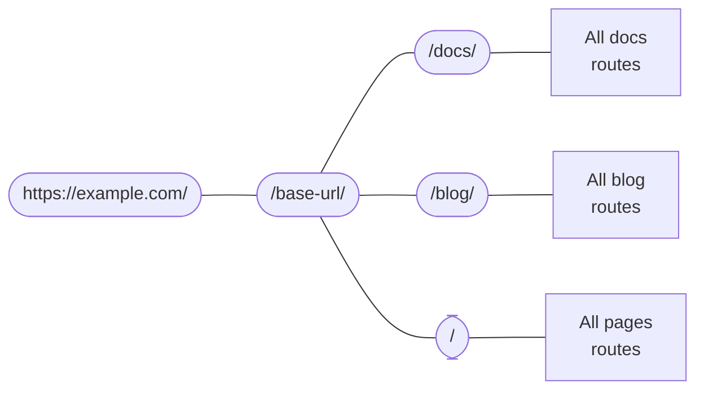

# 路由

```mdx-code-block
import Link from '@docusaurus/Link';
import {useLatestVersion, useActiveDocContext} from '@docusaurus/plugin-content-docs/client';
import {useLocation} from '@docusaurus/router';
import BrowserWindow from '@site/src/components/BrowserWindow';
```

Docusaurus 的路由系统遵循单页应用（SPA）的约定：一个路由，一个组件。在本节中，我们将首先讨论三个内容插件（文档、博客和页面）中的路由，然后更进一步，讨论底层的路由系统。

## 内容插件中的路由 {#routing-in-content-plugins}

每个内容插件都提供一个 `routeBasePath` 选项。它定义了插件将其路由附加到的位置。默认情况下，文档插件将其路由置于 `/docs` 下；博客插件置于 `/blog`下；而页面插件则置于 `/` 下。你可以这样理解路由结构：



任何路由都将与此嵌套路由配置进行匹配，直到找到合适的匹配项。例如，当给定路由 `/docs/configuration` 时，Docusaurus 首先进入 `/docs` 分支，然后在文档插件创建的子路由中进行搜索。

更改 `routeBasePath` 可以有效地改变你网站的路由结构。例如，在[纯文档模式](../guides/docs/docs-introduction.mdx#docs-only-mode)中，我们提到为文档配置 `routeBasePath: '/'` 意味着文档插件创建的所有路由都不会有 `/docs` 前缀，但这并不妨碍你拥有由其他插件创建的更多子路由，如 `/blog`。

接下来，让我们看看这三个插件如何构建它们自己的“子路由盒子”。

### 页面路由 {#pages-routing}

页面路由非常直接：文件路径直接映射到 URL，没有其他自定义方式。更多信息请参阅[页面文档](../guides/creating-pages.mdx#routing)。

用于 Markdown 页面的组件是 `@theme/MDXPage`。React 页面直接用作路由的组件。

### 博客路由 {#blog-routing}

博客会创建以下路由：

- **博文列表页**：`/`、`/page/2`、`/page/3`……
  - 路由可通过 `pageBasePath` 选项进行自定义。
  - 组件是 `@theme/BlogListPage`。
- **博文页**：`/2021/11/21/algolia-docsearch-migration`、`/2021/05/12/announcing-docusaurus-two-beta`……
  - 从每篇 Markdown 博文生成。
  - 路由可通过 `slug` front matter 进行完全自定义。
  - 组件是 `@theme/BlogPostPage`。
- **标签列表页**：`/tags`
  - 路由可通过 `tagsBasePath` 选项进行自定义。
  - 组件是 `@theme/BlogTagsListPage`。
- **标签页**：`/tags/adoption`、`/tags/beta`……
  - 通过每篇博文的 front matter 中定义的标签生成。
  - 路由总是以 `tagsBasePath` 中定义的路径为基础，但子路由可通过标签的 `permalink` 字段进行自定义。
  - 组件是 `@theme/BlogTagsPostsPage`。
- **归档页**：`/archive`
  - 路由可通过 `archiveBasePath` 选项进行自定义。
  - 组件是 `@theme/BlogArchivePage`。

### 文档路由 {#docs-routing}

文档是唯一一个创建**嵌套路由**的插件。在顶层，它注册了[**版本路径**](../guides/docs/versioning.mdx)：`/`、`/next`、`/2.0.0-beta.13`…… 这些路径提供了版本上下文，包括布局和侧边栏。这确保了在单个文档之间切换时，侧边栏的状态得以保留，并且你可以在停留在同一文档的同时通过导航栏下拉菜单切换版本。使用的组件是 `@theme/DocPage`。

```mdx-code-block
export const URLPath = () => <code>{useLocation().pathname}</code>;

export const FilePath = () => {
  const currentVersion = useActiveDocContext('default').activeVersion.name;
  return <code>{currentVersion === 'current' ? './docs/' : `./versioned_docs/version-${currentVersion}/`}advanced/routing.md</code>;
}
```

在 `DocPage` 组件提供了导航栏、页脚、侧边栏等所有内容之后，单个文档会在剩余的空间中渲染。例如，本页面 <URLPath /> 是由文件 <FilePath /> 生成的。使用的组件是 `@theme/DocItem`。

文档的 `slug` front matter 自定义了路由的最后一部分，但基础路由总是由插件的 `routeBasePath` 和版本的 `path` 定义。

### 文件路径和 URL 路径 {#file-paths-and-url-paths}

在整个文档中，我们总是力求明确我们是在讨论文件路径还是 URL 路径。内容插件通常将文件路径直接映射到 URL 路径，例如，`./docs/advanced/routing.md` 将变为 `/docs/advanced/routing`。然而，通过 `slug`，你可以使 URL 与文件结构完全解耦。

在 Markdown 中编写链接时，你可能指的是_文件路径_，也可能指的是_URL 路径_，Docusaurus 会使用几种启发式方法来确定。

- 如果路径有 `@site` 前缀，它_总是_一个资源文件路径。
- 如果路径有 `http(s)://` 前缀，它_总是_一个 URL 路径。
- 如果路径没有扩展名，它就是一个 URL 路径。例如，在 URL 为 `/docs/advanced/routing` 的页面上的链接 `[page](../plugins)` 将链接到 `/docs/plugins`。Docusaurus 只会在构建你的网站时（当它知道完整的路由结构时）检测到损坏的链接，但不会对文件的存在做任何假设。这与在 JSX 文件中编写 `<a href="../plugins">page</a>` 完全等效。
- 如果路径有 `.md(x)` 扩展名，Docusaurus 会尝试将该 Markdown 文件解析为 URL，并用 URL 路径替换文件路径。
- 如果路径有任何其他扩展名，Docusaurus 会将其视为[资源](../guides/markdown-features/markdown-features-assets.mdx)并进行打包。

以下目录结构可以帮助你形象地理解这种文件 → URL 的映射关系。假设所有页面都没有自定义 slug。

<details>

<summary>一个示例网站结构</summary>

```bash
.
├── blog                            # 博客插件的 routeBasePath 为 '/blog'
│   ├── 2019-05-28-first-blog-post.md       # -> /blog/2019/05/28/first-blog-post
│   ├── 2019-05-29-long-blog-post.md        # -> /blog/2019/05/29/long-blog-post
│   ├── 2021-08-01-mdx-blog-post.mdx        # -> /blog/2021/08/01/mdx-blog-post
│   └── 2021-08-26-welcome
│       ├── docusaurus-plushie-banner.jpeg
│       └── index.md                        # -> /blog/2021/08/26/welcome
├── docs                            # 文档插件的 routeBasePath 为 '/docs'；当前版本的基础路径为 '/'
│   ├── intro.md                            # -> /docs/intro
│   ├── tutorial-basics
│   │   ├── _category_.json
│   │   ├── congratulations.md              # -> /docs/tutorial-basics/congratulations
│   │   └── markdown-features.mdx           # -> /docs/tutorial-basics/markdown-features
│   └── tutorial-extras
│       ├── _category_.json
│       ├── manage-docs-versions.md         # -> /docs/tutorial-extras/manage-docs-versions
│       └── translate-your-site.md          # -> /docs/tutorial-extras/translate-your-site
├── src
│   └── pages                       # 页面插件的 routeBasePath 为 '/'
│       ├── index.module.css
│       ├── index.tsx                       # -> /
│       └── markdown-page.md                # -> /markdown-page
└── versioned_docs
    └── version-1.0.0               # 版本的基础路径为 '/1.0.0'
        ├── intro.md                        # -> /docs/1.0.0/intro
        ├── tutorial-basics
        │   ├── _category_.json
        │   ├── congratulations.md          # -> /docs/1.0.0/tutorial-basics/congratulations
        │   └── markdown-features.mdx       # -> /docs/1.0.0/tutorial-basics/markdown-features
        └── tutorial-extras
            ├── _category_.json
            ├── manage-docs-versions.md     # -> /docs/1.0.0/tutorial-extras/manage-docs-versions
            └── translate-your-site.md      # -> /docs/1.0.0/tutorial-extras/translate-your-site
```

</details>

关于内容插件就说这么多。让我们退一步，笼统地谈谈路由在 Docusaurus 应用中是如何工作的。

## 路由成为 HTML 文件 {#routes-become-html-files}

因为 Docusaurus 是一个服务端渲染框架，所有生成的路由都将被服务端渲染成静态 HTML 文件。如果你熟悉像 [Apache2](https://httpd.apache.org/docs/trunk/getting-started.html) 这样的 HTTP 服务器的行为，你就会明白这是如何完成的：当浏览器向路由 `/docs/advanced/routing` 发送请求时，服务器会将其解释为对 HTML 文件 `/docs/advanced/routing/index.html` 的请求，并返回该文件。

路由 `/docs/advanced/routing` 可以对应 `/docs/advanced/routing/index.html` 或 `/docs/advanced/routing.html`。一些托管服务提供商通过是否存在尾部斜杠来区分它们，并且可能容忍也可能不容忍另一种形式。在[尾部斜杠指南](https://github.com/slorber/trailing-slash-guide)中阅读更多内容。

例如，上述目录的构建输出是（忽略其他资源和 JS 打包文件）：

<details>

<summary>上述工作空间的输出</summary>

```bash
build
├── 404.html                      # /404/
├── blog
│   ├── archive
│   │   └── index.html            # /blog/archive/
│   ├── first-blog-post
│   │   └── index.html            # /blog/first-blog-post/
│   ├── index.html                # /blog/
│   ├── long-blog-post
│   │   └── index.html            # /blog/long-blog-post/
│   ├── mdx-blog-post
│   │   └── index.html            # /blog/mdx-blog-post/
│   ├── tags
│   │   ├── docusaurus
│   │   │   └── index.html        # /blog/tags/docusaurus/
│   │   ├── hola
│   │   │   └── index.html        # /blog/tags/hola/
│   │   └── index.html            # /blog/tags/
│   └── welcome
│       └── index.html            # /blog/welcome/
├── docs
│   ├── 1.0.0
│   │   ├── intro
│   │   │   └── index.html        # /docs/1.0.0/intro/
│   │   ├── tutorial-basics
│   │   │   ├── congratulations
│   │   │   │   └── index.html    # /docs/1.0.0/tutorial-basics/congratulations/
│   │   │   └── markdown-features
│   │   │       └── index.html    # /docs/1.0.0/tutorial-basics/markdown-features/
│   │   └── tutorial-extras
│   │       ├── manage-docs-versions
│   │       │   └── index.html    # /docs/1.0.0/tutorial-extras/manage-docs-versions/
│   │       └── translate-your-site
│   │           └── index.html    # /docs/1.0.0/tutorial-extras/translate-your-site/
│   ├── intro
│   │   └── index.html            # /docs/1.0.0/intro/
│   ├── tutorial-basics
│   │   ├── congratulations
│   │   │   └── index.html        # /docs/tutorial-basics/congratulations/
│   │   └── markdown-features
│   │       └── index.html        # /docs/tutorial-basics/markdown-features/
│   └── tutorial-extras
│       ├── manage-docs-versions
│       │   └── index.html        # /docs/tutorial-extras/manage-docs-versions/
│       └── translate-your-site
│           └── index.html        # /docs/tutorial-extras/translate-your-site/
├── index.html                    # /
└── markdown-page
    └── index.html                # /markdown-page/
```

</details>

如果 `trailingSlash` 设置为 `false`，构建过程将生成 `intro.html` 而不是 `intro/index.html`。

所有 HTML 文件都将使用绝对 URL 引用其 JS 资源，因此为了正确定位资源，你必须配置 `baseUrl` 字段。请注意，`baseUrl` 不会影响生成的打包文件的文件结构：基础 URL 比 Docusaurus 路由系统高一个级别。你可以将 `url` 和 `baseUrl` 的聚合视为你 Docusaurus 网站的实际位置。

例如，生成的 HTML 将包含诸如 `<link rel="preload" href="/assets/js/runtime~main.7ed5108a.js" as="script">` 之类的链接。因为绝对 URL 是从主机解析的，如果打包文件放置在路径 `https://example.com/base/` 下，该链接将指向 `https://example.com/assets/js/runtime~main.7ed5108a.js`，而这个文件是不存在的。通过将 `/base/` 指定为基础 URL，链接将正确指向 `/base/assets/js/runtime~main.7ed5108a.js`。

本地化网站的区域设置也是基础 URL 的一部分。例如，`https://docusaurus.io/zh-CN/docs/advanced/routing/` 的基础 URL 是 `/zh-CN/`。

## 生成和访问路由 {#generating-and-accessing-routes}

`addRoute` 生命周期操作用于生成路由。它将一个路由配置注册到路由树中，提供一个路由、一个组件以及该组件所需的 props。props 和组件都作为路径提供给打包工具进行 `require`，因为正如在[架构概览](architecture.mdx)中解释的那样，服务端和客户端仅通过临时文件进行通信。

所有路由都聚合在 `.docusaurus/routes.js` 中，你可以通过调试插件的[路由面板](/__docusaurus/debug/routes)查看。

在客户端，我们提供 `@docusaurus/router` 来访问页面的路由。`@docusaurus/router` 是 [`react-router-dom`](https://www.npmjs.com/package/react-router-dom/v/5.3.0) 包的再导出。例如，你可以使用 `useLocation` 来获取当前页面的 [location](https://developer.mozilla.org/en-US/docs/Web/API/Location)，使用 `useHistory` 来访问 [history 对象](https://developer.mozilla.org/en-US/docs/Web/API/History)。（它们与浏览器 API 不同，尽管功能相似。具体 API 请参考 React Router 文档。）

此 API 是**服务端渲染安全**的，与仅限浏览器的 `window.location` 相反。

```jsx title="myComponent.js"
import React from 'react';
import {useLocation} from '@docusaurus/router';

export function PageRoute() {
  // 即便在服务端渲染 (SSR) 中，React Router 也会提供当前组件的路由
  const location = useLocation();
  return (
    <span>
      We are currently on <code>{location.pathname}</code>
    </span>
  );
}
```

```mdx-code-block
export function PageRoute() {
  const location = useLocation();
  return (
    <span>
      We are currently on <code>{location.pathname}</code>
    </span>
  );
}

<BrowserWindow>

<PageRoute />

</BrowserWindow>
```

## 避开单页应用（SPA）重定向 {#escaping-from-spa-redirects}

Docusaurus 构建的是一个[单页应用](https://developer.mozilla.org/en-US/docs/Glossary/SPA)，其中的路由转换是通过 React Router 的 `history.push()` 方法完成的。此操作在客户端完成。然而，以这种方式进行路由转换的前提是目标 URL 对我们的路由器是已知的。否则，路由器会捕获此路径并显示 404 页面。

如果你将一些 HTML 页面放在 `static` 文件夹下，它们将被复制到构建输出中，因此可以作为你网站的一部分进行访问，但它不属于 Docusaurus 路由系统。我们提供了一个 `pathname://` 协议，允许你以非 SPA 的方式重定向到你域名的另一部分，就好像这个路由是一个外部链接一样。

```md
- [pathname:///pure-html](pathname:///pure-html)
```

<BrowserWindow>

- [`pathname:///pure-html`](pathname:///pure-html)

</BrowserWindow>

`pathname://` 协议对于引用 static 文件夹中的任何内容都很有用。例如，Docusaurus 会将[所有 Markdown 静态资源转换为 require() 调用](../guides/markdown-features/markdown-features-assets.mdx#static-assets)。你可以使用 `pathname://` 来使其保持为常规链接，而不是被 Webpack 哈希处理。

```md title="my-doc.md"


[An asset from the static](pathname:///files/asset.pdf)
```

Docusaurus 只会剥离 `pathname://` 前缀，而不会处理其内容。
